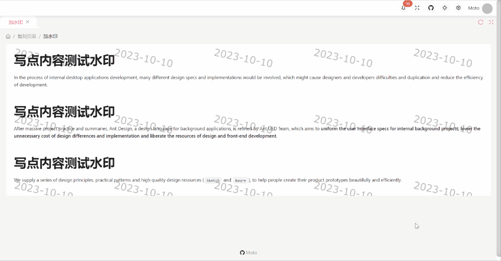

# React 后台管理模板

## 技术栈

- `React+Vite+TypeScript`
- `Ant Design`
- `React Router`
- `React Context`

## 特性

- 纯前端, 采用`mock.js`进行数据获取
- `React Context`状态管理方案
- 拥抱`Hooks`
- 强制进行单页面跳转

## 演示复刻

- 加水印 
- 图片标注 